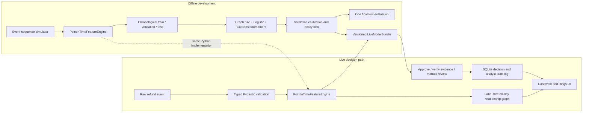

# MarginShield Architecture

## Trust Boundaries

- Raw events contain only information available before refund disposition.
- Features are computed before the current event is committed.
- The serialized bundle stores the exact feature names, medians, category handling,
  model, calibrator, threshold, target, and version.
- Ring grouping uses submitted identifiers and model scores, never evaluation labels.
- Simulator labels and topology metadata exist only for offline evaluation.
- Analyst outcomes are append-only events in the local prototype audit database.

## Runtime Order

`POST /api/events` validates the payload, rejects duplicates or out-of-order events,
computes point-in-time features, scores the frozen bundle, creates a structural
action, stores the complete decision record, then commits the event to feature
state. This ordering prevents the current request from becoming its own history.

The prototype replays the shipped historical dataset and prior live events at
startup. Production requires a durable feature store, event-time buffering,
authentication, encryption, privacy-safe identifiers, and concurrency controls
beyond this single-process lock.

